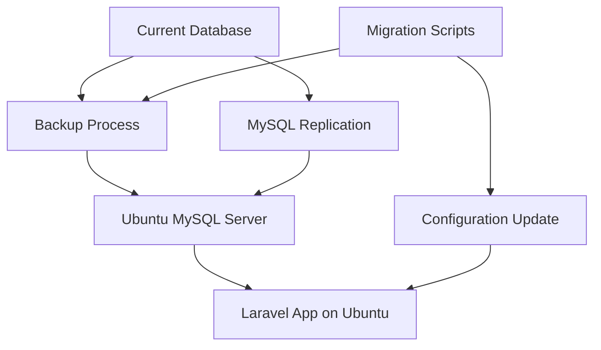

# Design Document

## Overview

This design outlines the migration of the Laravel application's MySQL database from the current environment to an Ubuntu server (165.22.112.94) with ongoing synchronization capabilities. The solution uses MySQL's built-in replication features and Laravel configuration updates.

## Architecture



## Components and Interfaces

### 1. Database Migration Component
- **Backup Service**: Creates mysqldump of current database
- **Ubuntu MySQL Setup**: Installs and configures MySQL 8.0 on Ubuntu server
- **Restore Service**: Imports backup data to Ubuntu MySQL
- **Validation Service**: Verifies data integrity after migration

### 2. Synchronization Component
- **MySQL Master-Slave Replication**: Real-time data sync from source to Ubuntu
- **Replication Monitor**: Tracks sync status and lag
- **Error Handler**: Manages replication failures and recovery

### 3. Configuration Management
- **Environment Updater**: Updates Laravel .env file for Ubuntu database
- **Connection Tester**: Validates database connectivity
- **Rollback Manager**: Reverts to original configuration if needed

## Data Models

### Migration Status
```php
class MigrationStatus {
    public string $phase;           // backup, install, restore, sync, complete
    public float $progress;         // 0-100 percentage
    public array $errors;           // Error messages
    public DateTime $startTime;
    public DateTime $lastUpdate;
}
```

### Sync Status
```php
class SyncStatus {
    public bool $isActive;
    public int $lagSeconds;
    public DateTime $lastSync;
    public array $errors;
}
```

## Error Handling

### Migration Errors
- **Backup Failures**: Retry with different mysqldump options, fallback to table-by-table export
- **Network Issues**: Implement retry logic with exponential backoff
- **Disk Space**: Check available space before operations
- **Permission Errors**: Provide clear instructions for manual fixes

### Synchronization Errors
- **Replication Lag**: Alert when lag exceeds 30 seconds
- **Connection Loss**: Auto-reconnect with position recovery
- **Binary Log Issues**: Skip problematic transactions with logging

## Testing Strategy

### Unit Tests
- Database backup/restore functions
- Configuration file updates
- Error handling scenarios

### Integration Tests
- End-to-end migration process
- Replication setup and monitoring
- Laravel application connectivity

### Manual Testing
- Verify data integrity after migration
- Test application functionality with Ubuntu database
- Validate rollback procedures