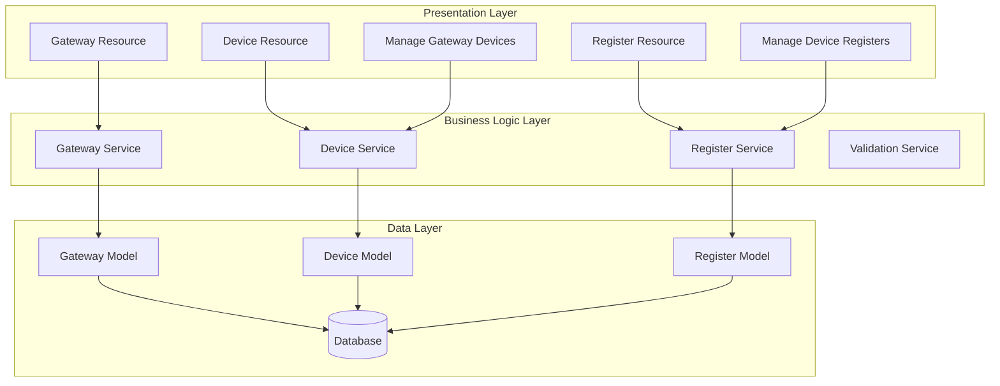
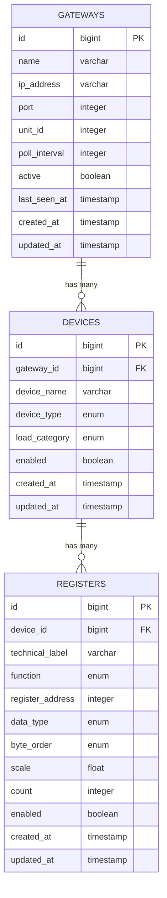
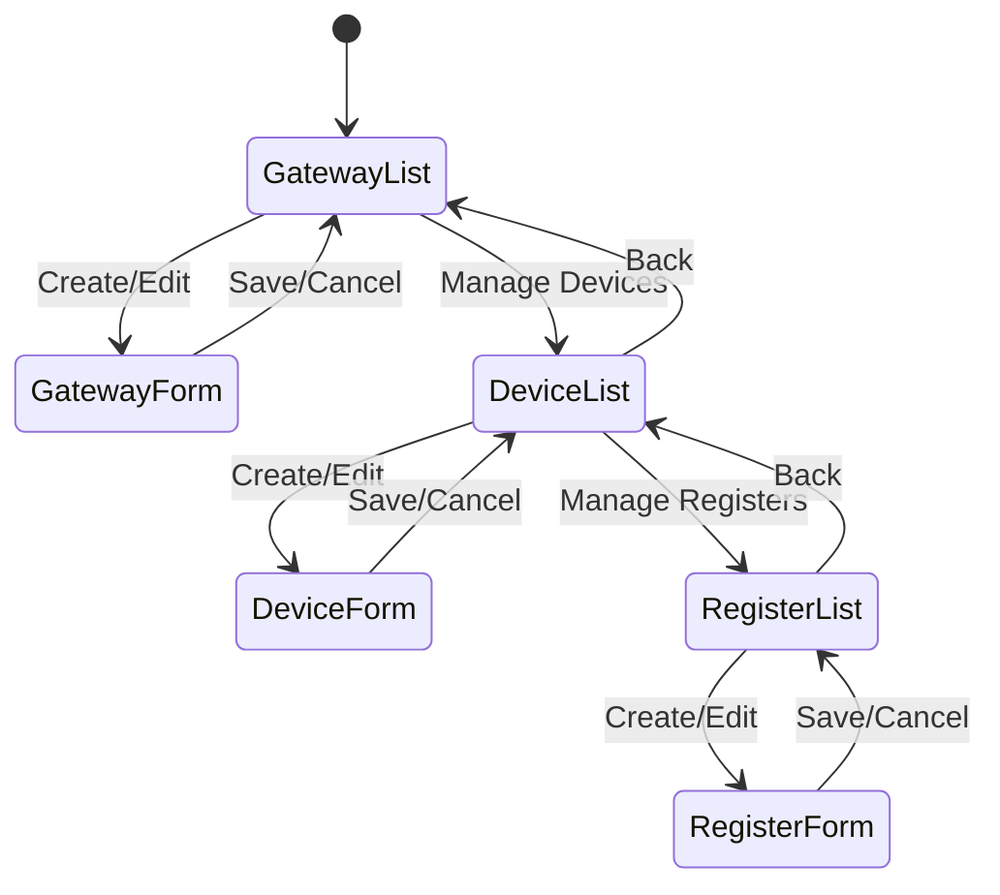

# Design Document

## Overview

The modular management system implements a three-tier hierarchical architecture for managing Modbus TCP infrastructure: Gateways → Devices → Registers. This design leverages FilamentPHP's resource management capabilities to provide intuitive CRUD operations at each level while maintaining proper data relationships and navigation flow.

The system builds upon the existing Laravel/FilamentPHP codebase, utilizing the current Gateway and DataPoint models while introducing a new Device model to properly separate concerns and improve data organization.

## Architecture

### High-Level Architecture



### Database Schema Design

The system uses a normalized three-table structure with proper foreign key relationships:



### Navigation Flow Design

The system implements a hierarchical navigation pattern:



## Components and Interfaces

### 1. Gateway Management Component

**Purpose**: Manages Modbus TCP gateway configurations and provides entry point to device management.

**Key Features**:
- CRUD operations for gateway entities
- Connection testing functionality
- Gateway status monitoring
- Navigation to device management

**FilamentPHP Resources**:
- `GatewayResource`: Main resource for gateway management
- `ListGateways`: Table view with statistics
- `CreateGateway`/`EditGateway`: Form management
- `ManageGatewayDevices`: Custom page for device management

### 2. Device Management Component

**Purpose**: Manages devices associated with specific gateways, providing categorization and organization.

**Key Features**:
- Device CRUD operations within gateway context
- Device type and load category management
- Register count tracking
- Navigation to register management

**FilamentPHP Resources**:
- `DeviceResource`: Standalone device resource (optional)
- `ManageGatewayDevices`: Primary device management interface
- Device forms integrated into gateway workflow

### 3. Register Management Component

**Purpose**: Manages individual Modbus registers for specific devices with full Modbus configuration.

**Key Features**:
- Register CRUD operations within device context
- Modbus function and data type configuration
- Byte order and scaling management
- Bulk enable/disable operations

**FilamentPHP Resources**:
- `ManageDeviceRegisters`: Primary register management interface
- Register forms with Modbus-specific validation

### 4. Model Relationships

**Gateway Model**:
```php
class Gateway extends Model
{
    public function devices(): HasMany
    {
        return $this->hasMany(Device::class);
    }
    
    public function registers(): HasManyThrough
    {
        return $this->hasManyThrough(Register::class, Device::class);
    }
}
```

**Device Model**:
```php
class Device extends Model
{
    public function gateway(): BelongsTo
    {
        return $this->belongsTo(Gateway::class);
    }
    
    public function registers(): HasMany
    {
        return $this->hasMany(Register::class);
    }
}
```

**Register Model**:
```php
class Register extends Model
{
    public function device(): BelongsTo
    {
        return $this->belongsTo(Device::class);
    }
    
    public function gateway(): BelongsTo
    {
        return $this->device->gateway();
    }
}
```

## Data Models

### Gateway Data Model

```php
protected $fillable = [
    'name',
    'ip_address', 
    'port',
    'unit_id',
    'poll_interval',
    'active',
    'last_seen_at'
];

protected $casts = [
    'port' => 'integer',
    'unit_id' => 'integer', 
    'poll_interval' => 'integer',
    'active' => 'boolean',
    'last_seen_at' => 'datetime'
];
```

### Device Data Model

```php
protected $fillable = [
    'gateway_id',
    'device_name',
    'device_type',
    'load_category', 
    'enabled'
];

protected $casts = [
    'gateway_id' => 'integer',
    'enabled' => 'boolean'
];

// Enums
const DEVICE_TYPES = [
    'energy_meter' => 'Energy Meter',
    'water_meter' => 'Water Meter', 
    'control' => 'Control Device'
];

const LOAD_CATEGORIES = [
    'hvac' => 'HVAC',
    'lighting' => 'Lighting',
    'sockets' => 'Sockets',
    'other' => 'Other'
];
```

### Register Data Model

```php
protected $fillable = [
    'device_id',
    'technical_label',
    'function',
    'register_address',
    'data_type',
    'byte_order',
    'scale',
    'count',
    'enabled'
];

protected $casts = [
    'device_id' => 'integer',
    'function' => 'integer',
    'register_address' => 'integer', 
    'scale' => 'float',
    'count' => 'integer',
    'enabled' => 'boolean'
];

// Enums
const FUNCTIONS = [
    1 => 'Coils',
    2 => 'Discrete Inputs', 
    3 => 'Holding Registers',
    4 => 'Input Registers'
];

const DATA_TYPES = [
    'int16' => 'Int16',
    'uint16' => 'UInt16',
    'float32' => 'Float32',
    'int32' => 'Int32'
];

const BYTE_ORDERS = [
    'big_endian' => 'Big Endian',
    'little_endian' => 'Little Endian', 
    'word_swap' => 'Word Swap',
    'byte_swap' => 'Byte Swap'
];
```

## Error Handling

### Validation Strategy

**Gateway Validation**:
- IP address format validation using Laravel's `ip` rule
- Port range validation (1-65535)
- Unique IP/port combination validation
- Required field validation

**Device Validation**:
- Foreign key constraint validation for gateway_id
- Device name uniqueness within gateway scope
- Enum validation for device_type and load_category

**Register Validation**:
- Foreign key constraint validation for device_id
- Register address range validation (0-65535)
- Modbus function enum validation (1-4)
- Data type and byte order enum validation
- Scale factor numeric validation

### Error Response Handling

```php
// Custom validation rules
class ModbusAddressRule implements Rule
{
    public function passes($attribute, $value)
    {
        return is_numeric($value) && $value >= 0 && $value <= 65535;
    }
    
    public function message()
    {
        return 'Register address must be between 0 and 65535.';
    }
}

// Exception handling in services
class DeviceService
{
    public function createDevice(array $data): Device
    {
        try {
            return Device::create($data);
        } catch (QueryException $e) {
            if ($e->getCode() === '23000') {
                throw new ValidationException('Gateway not found or invalid.');
            }
            throw $e;
        }
    }
}
```

### User-Friendly Error Messages

- Database constraint violations → "Invalid gateway selection"
- Validation failures → Field-specific error messages
- Network errors → "Connection test failed - check IP and port"
- Duplicate entries → "A device with this name already exists"

## Testing Strategy

### Unit Testing Approach

**Model Testing**:
- Relationship integrity testing
- Attribute casting validation
- Scope method testing
- Computed attribute testing

**Validation Testing**:
- Form validation rule testing
- Custom validation rule testing
- Error message accuracy testing

**Service Testing**:
- CRUD operation testing
- Business logic validation
- Exception handling testing

### Integration Testing Approach

**FilamentPHP Resource Testing**:
- Table rendering and data display
- Form submission and validation
- Action execution testing
- Navigation flow testing

**Database Integration Testing**:
- Foreign key constraint testing
- Cascade deletion testing
- Transaction integrity testing

### Test Structure Example

```php
class GatewayResourceTest extends TestCase
{
    use RefreshDatabase;
    
    public function test_can_list_gateways()
    {
        $gateway = Gateway::factory()->create();
        
        $this->get(GatewayResource::getUrl('index'))
            ->assertSuccessful()
            ->assertSee($gateway->name);
    }
    
    public function test_can_create_gateway_with_valid_data()
    {
        $data = [
            'name' => 'Test Gateway',
            'ip_address' => '192.168.1.100',
            'port' => 502,
            'unit_id' => 1,
            'poll_interval' => 10,
            'active' => true
        ];
        
        $this->post(GatewayResource::getUrl('create'), $data)
            ->assertRedirect();
            
        $this->assertDatabaseHas('gateways', $data);
    }
}
```

### Performance Testing Considerations

- Large dataset handling (1000+ gateways, 10000+ devices)
- Hierarchical navigation performance
- Table pagination and filtering performance
- Bulk operation performance testing

## Implementation Notes

### Migration from Current System

The current system uses a flattened structure where DataPoint contains device information. The migration strategy:

1. **Create Device Model**: Extract device information from DataPoint
2. **Create Migration**: Populate devices table from existing DataPoint data
3. **Update DataPoint**: Add device_id foreign key, remove device fields
4. **Update Resources**: Modify existing resources to use new structure
5. **Preserve Data**: Ensure no data loss during migration

### FilamentPHP Integration Points

**Custom Pages**:
- `ManageGatewayDevices`: Custom page within GatewayResource
- `ManageDeviceRegisters`: Custom page for register management
- Breadcrumb navigation between levels
- Context preservation across navigation

**Form Components**:
- Dynamic field updates (data type → count auto-fill)
- Conditional field display based on device type
- Bulk action forms for register management

**Table Enhancements**:
- Custom columns for computed values (register counts, status)
- Action buttons for navigation between levels
- Filtering and search across hierarchy levels

### Security Considerations

- Authorization policies for each resource level
- Gateway access control based on user permissions
- Audit logging for configuration changes
- Input sanitization for IP addresses and technical labels