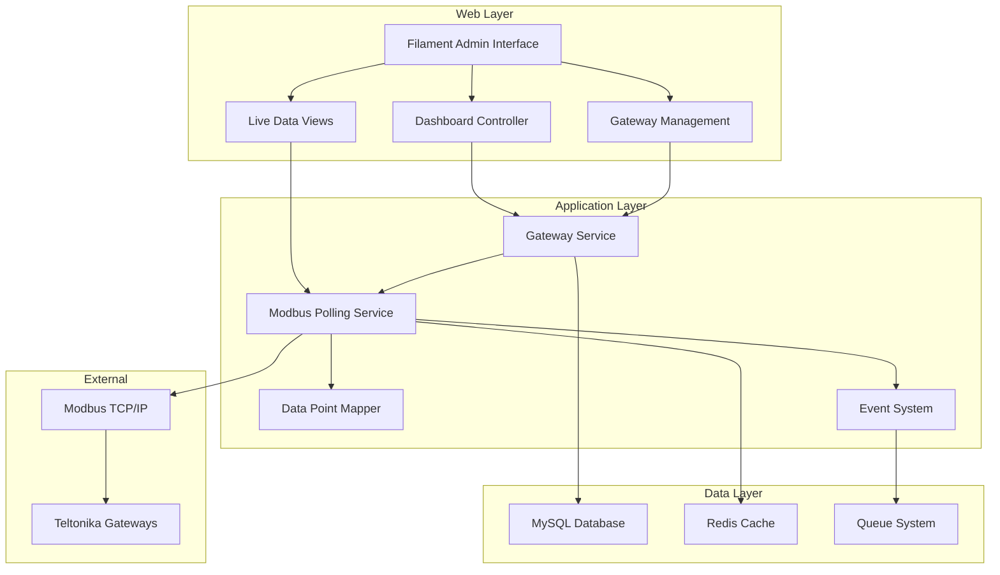

# Design Document - Teltonika Gateway Monitor

## Overview

The Teltonika Gateway Monitor is a Laravel-based web application that provides real-time monitoring and management of Modbus-enabled Teltonika energy meters. The system follows a modern MVC architecture with Filament Admin for the administrative interface, emphasizing real-time data collection, visualization, and industrial-grade reliability.

### Key Design Principles
- **Real-time Performance**: Sub-second dashboard updates with WebSocket connections
- **Industrial Reliability**: Robust error handling and connection management for industrial environments
- **Responsive Design**: Mobile-first approach with progressive enhancement
- **Accessibility**: WCAG AA compliance throughout the interface
- **Scalability**: Designed to handle hundreds of gateways with efficient polling strategies

## Architecture

### System Architecture



### Technology Stack
- **Backend**: Laravel 10+ with PHP 8.2+
- **Frontend**: Filament Admin Panel with Livewire components
- **Database**: MySQL 8.0+ for primary data storage
- **Cache**: Redis for session management and real-time data caching
- **Queue**: Laravel Queues with Redis driver for background processing
- **Modbus**: ReactPHP-based asynchronous Modbus TCP client
- **Real-time**: Laravel Echo with Pusher for WebSocket connections

## Components and Interfaces

### Core Models

#### Gateway Model
```php
class Gateway extends Model
{
    protected $fillable = [
        'name', 'ip_address', 'port', 'unit_id', 
        'poll_interval', 'is_active', 'last_seen_at'
    ];
    
    protected $casts = [
        'last_seen_at' => 'datetime',
        'is_active' => 'boolean',
        'poll_interval' => 'integer'
    ];
}
```

**Design Rationale**: Simple model structure focusing on connection parameters with timestamps for monitoring gateway health.

#### DataPoint Model
```php
class DataPoint extends Model
{
    protected $fillable = [
        'gateway_id', 'group_name', 'label', 'modbus_function',
        'register_address', 'register_count', 'data_type', 
        'scale_factor', 'is_enabled'
    ];
    
    protected $casts = [
        'register_address' => 'integer',
        'register_count' => 'integer',
        'scale_factor' => 'float',
        'is_enabled' => 'boolean'
    ];
}
```

**Design Rationale**: Flexible data point configuration supporting various Modbus data types and scaling factors for different meter types.

#### Reading Model
```php
class Reading extends Model
{
    protected $fillable = [
        'data_point_id', 'raw_value', 'scaled_value', 
        'quality', 'read_at'
    ];
    
    protected $casts = [
        'raw_value' => 'string',
        'scaled_value' => 'float',
        'read_at' => 'datetime'
    ];
}
```

### Service Layer

#### ModbusPollService
Handles asynchronous polling of Modbus devices with connection pooling and error recovery.

```php
class ModbusPollService
{
    public function pollGateway(Gateway $gateway): PollResult
    public function testConnection(string $ip, int $port, int $unitId): ConnectionTest
    public function readRegister(Gateway $gateway, DataPoint $point): ReadingResult
}
```

**Design Rationale**: Centralized polling service with async capabilities to handle multiple gateways simultaneously without blocking.

#### GatewayManagementService
Orchestrates gateway lifecycle operations including configuration validation and health monitoring.

```php
class GatewayManagementService
{
    public function createGateway(array $config): Gateway
    public function validateConfiguration(array $config): ValidationResult
    public function pausePolling(Gateway $gateway): void
    public function resumePolling(Gateway $gateway): void
}
```

### Frontend Components

#### Dashboard Component (Livewire)
Real-time dashboard with KPI tiles, fleet status, and event stream.

**Key Features**:
- Auto-refreshing KPI calculations
- WebSocket integration for live updates
- Responsive grid layout with mobile stacking
- Sparkline charts using Chart.js

#### Gateway Management Interface (Filament Resource)
CRUD interface for gateway configuration with wizard-style setup.

**Key Features**:
- Multi-step wizard (Connect → Map Points → Review)
- Real-time connection testing
- Bulk operations support
- Context drawer for quick edits

#### Live Data View (Livewire)
Real-time data table with filtering and trend visualization.

**Key Features**:
- Sticky headers with horizontal scrolling
- Mini trend charts (last 10 readings)
- Filter chips for Gateway/Group/Tag
- Density toggle (Comfortable/Compact)

## Data Models

### Database Schema

#### Gateways Table
```sql
CREATE TABLE gateways (
    id BIGINT UNSIGNED AUTO_INCREMENT PRIMARY KEY,
    name VARCHAR(255) NOT NULL,
    ip_address VARCHAR(45) NOT NULL,
    port INT UNSIGNED DEFAULT 502,
    unit_id TINYINT UNSIGNED DEFAULT 1,
    poll_interval INT UNSIGNED DEFAULT 10,
    is_active BOOLEAN DEFAULT TRUE,
    last_seen_at TIMESTAMP NULL,
    success_count INT UNSIGNED DEFAULT 0,
    failure_count INT UNSIGNED DEFAULT 0,
    created_at TIMESTAMP NULL,
    updated_at TIMESTAMP NULL,
    INDEX idx_active_gateways (is_active, last_seen_at),
    UNIQUE KEY unique_gateway (ip_address, port, unit_id)
);
```

#### Data Points Table
```sql
CREATE TABLE data_points (
    id BIGINT UNSIGNED AUTO_INCREMENT PRIMARY KEY,
    gateway_id BIGINT UNSIGNED NOT NULL,
    group_name VARCHAR(100) NOT NULL,
    label VARCHAR(255) NOT NULL,
    modbus_function TINYINT UNSIGNED NOT NULL,
    register_address INT UNSIGNED NOT NULL,
    register_count TINYINT UNSIGNED DEFAULT 2,
    data_type ENUM('int16', 'uint16', 'int32', 'uint32', 'float32', 'float64') DEFAULT 'float32',
    byte_order ENUM('big_endian', 'little_endian', 'word_swapped') DEFAULT 'word_swapped',
    scale_factor DECIMAL(10,6) DEFAULT 1.0,
    is_enabled BOOLEAN DEFAULT TRUE,
    created_at TIMESTAMP NULL,
    updated_at TIMESTAMP NULL,
    FOREIGN KEY (gateway_id) REFERENCES gateways(id) ON DELETE CASCADE,
    INDEX idx_gateway_enabled (gateway_id, is_enabled),
    INDEX idx_group_points (gateway_id, group_name)
);
```

#### Readings Table
```sql
CREATE TABLE readings (
    id BIGINT UNSIGNED AUTO_INCREMENT PRIMARY KEY,
    data_point_id BIGINT UNSIGNED NOT NULL,
    raw_value TEXT,
    scaled_value DECIMAL(15,6),
    quality ENUM('good', 'bad', 'uncertain') DEFAULT 'good',
    read_at TIMESTAMP NOT NULL,
    created_at TIMESTAMP NULL,
    FOREIGN KEY (data_point_id) REFERENCES data_points(id) ON DELETE CASCADE,
    INDEX idx_point_time (data_point_id, read_at),
    INDEX idx_recent_readings (read_at)
);
```

**Design Rationale**: Normalized schema with proper indexing for time-series queries. Separate raw and scaled values for debugging. Quality indicators for industrial reliability.

### Data Flow

1. **Polling Cycle**: Background jobs poll each active gateway at configured intervals
2. **Data Processing**: Raw Modbus values are decoded based on data point configuration
3. **Storage**: Readings are stored with quality indicators and timestamps
4. **Real-time Updates**: WebSocket events notify frontend of new data
5. **Aggregation**: Dashboard KPIs are calculated from recent readings

## Error Handling

### Connection Management
- **Timeout Handling**: 5-second connection timeout with exponential backoff
- **Retry Logic**: 3 retry attempts with increasing delays (1s, 2s, 4s)
- **Circuit Breaker**: Automatic gateway disabling after 10 consecutive failures
- **Health Monitoring**: Periodic health checks for offline gateways

### Data Quality Management
- **Validation**: Register value bounds checking (1-65535)
- **Type Safety**: Strict data type validation during Modbus decoding
- **Quality Flags**: Good/Bad/Uncertain quality indicators for each reading
- **Error Logging**: Comprehensive logging for troubleshooting

### User Experience
- **Graceful Degradation**: Partial functionality when some gateways are offline
- **Clear Messaging**: Specific error messages for different failure scenarios
- **Recovery Actions**: User-initiated retry and reset capabilities
- **Undo Operations**: Reversible actions for critical configuration changes

## Testing Strategy

### Unit Testing
- **Model Tests**: Validation rules, relationships, and business logic
- **Service Tests**: Modbus communication, data processing, and error handling
- **Component Tests**: Livewire component behavior and state management

### Integration Testing
- **Database Tests**: Schema validation and query performance
- **API Tests**: Modbus protocol compliance and error scenarios
- **Feature Tests**: End-to-end user workflows and edge cases

### Performance Testing
- **Load Testing**: Multiple gateway polling under high load
- **Stress Testing**: Database performance with large datasets
- **Real-time Testing**: WebSocket performance and memory usage

### Accessibility Testing
- **Automated Testing**: axe-core integration for WCAG compliance
- **Manual Testing**: Keyboard navigation and screen reader compatibility
- **Mobile Testing**: Responsive design across device sizes

**Design Rationale**: Comprehensive testing strategy ensuring industrial-grade reliability and accessibility compliance while maintaining development velocity.